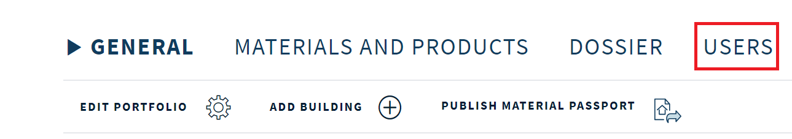

# Madaster Private API
The **Madaster Private API** endpoint can be used to interact with the Madaster Platform and its resources.
This API does not fully cover all functionality of the platform yet, please refer to the [*docs*](https://api.madaster.com/docs) files or the [Swagger/OpenAPI documentation](https://api.madaster.com/swagger).

To access the API resources, you need an authorization token.
If you do not have one yet, see the chapter about Authorization below.
This token should be sent as a header with the name 'X-API-Key', which will authenticate the request with the token.
To find out which requests are available and which responses they might produce, see the [*docs*](https://api.madaster.com/docs) files or the [Swagger/OpenAPI documentation](https://api.madaster.com/swagger).

This API can be reached at the endpoint: **[https://api.madaster.com/](https://api.madaster.com/)** 
The interactive Swagger/OpenAPI documentation can be found at: **[https://api.madaster.com/swagger](https://api.madaster.com/swagger)** 
If you prefer a static documentation: **[https://api.madaster.com/docs](https://api.madaster.com/docs)**

## Authorization
To access the resources of this API, you need an API key. This key needs to be attached to the request in the *X-API-Key* header.
To acquire an API key, you need to add a token to either a Portfolio or a Building in the Madaster Platform, or ask your account manager to do this for you.
This will give you access to these resources and their attached entities.

### Add a token to a portfolio
- Go to the building page and click on the *Users* tab

- Click on the *Add API Token* button

- Enter a name for this token, click on the gear icon (2), choose a permission level and expiration time, and finish by clicking on the Add button

### Add a token to a building
- Go to the portfolio page and click on the *Users* tab

- Click on the *Add API Token* button

- Enter a name for this token, click on the gear icon (2), choose a permission level and expiration time, and finish by clicking on the Add button

