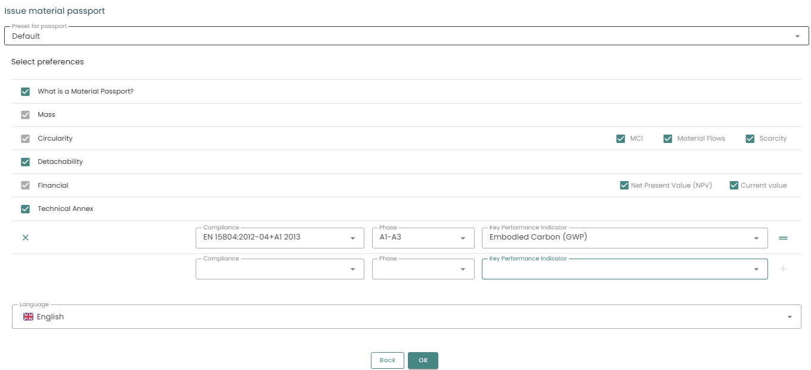

Exportvarianten des digitalen Materialpasses

Es gibt jetzt verschiedene Arten von Pässen: den One-Pager, eine Kurzfassung und einen (vollständigen) Pass, der einen technischen Anhang mit den Basisdaten in einer Excel-Datei enthalten kann. Außerdem ist es jetzt möglich, die Daten, die in den Pass aufgenommen werden können, vorzugeben, z. B. den Madaster Circularity Index oder einen der Umwelt-KPIs.

Wenn Sie einen Materialpass ausstellen, können Sie wählen, welche Art von Pass erstellt werden soll und welche Informationen im Pass enthalten sein sollen. Sie können eine Voreinstellung verwenden (falls verfügbar) oder auswählen, welche Informationen angezeigt werden sollen, z. B. Kreislaufwirtschaft, Materialien, Finanz- und Umweltinformationen.

> Beachten Sie, dass Sie, wenn Sie einen zusätzlichen KPI hinzufügen möchten, auf das + am Ende klicken müssen, damit er in den Pass aufgenommen wird.

## Arten von Materialpässen

Madaster bietet eine Vielzahl von Pässen an, die Sie erstellen können. Der Unterschied liegt im Detailgrad der verschiedenen Pässe.
 
Auf der ersten Seite ist ein QR-Code eingebettet, der auf das Objekt auf der Madaster-Plattform verweist (für autorisierte Konten).

### One-pager

In einem OnePager ist der Detailgrad minimal. Für die ausgewählten Kategorien werden die wichtigsten Informationen auf einer Seite pdf angezeigt.

### Kurzfassung

Die Kurzfassung ist etwas ausführlicher als der One-Pager.

Dieser Pass beginnt mit den **allgemeinen Informationen** des Objekts, wie Bauphase, Brutto-Innenfläche und Lebensdauer. Danach werden Informationen über die **Quellen** (ifc-Dateien oder Excel-Dokumente) und deren geprüfte Vollständigkeit angezeigt. Hier können Sie die verwendeten Dateien und Klassifizierungsmethoden, sowie die verwendeten Datenbanken einsehen.

Danach folgen die detaillierteren Berichte pro Kategorie (Masse, Zirkularität, etc.) und deren Zahlen und Grafiken.

### Vollständiger Materialpass

Dieser Pass ist der detaillierteste aller verfügbaren Pässe und bietet dem Leser fast alle Informationen, die auf der Madaster-Plattform zu finden sind, im PDF-Format. Jede Registerkarte in Madaster wird in die PDF-Datei übersetzt, einschließlich der verschiedenen Diagramme und Berechnungen, zusammen mit einigen zusätzlichen Informationen darüber, wie diese Zahlen berechnet werden und zu interpretieren sind.

Zusätzlich kann ein technischer Annex in Form eines Excelexports über alleemente und verknüpften Produkte generiert werden. 

### Webbasierter One-pager

Zusätzlich zum One-Pager, der Zusammenfassung und dem Materialpass ist es auch möglich, einen webbasierten Pass zu erstellen. Dieser webbasierte Pass ähnelt dem One-Pager, steht aber online zur Verfügung, damit Sie ihn mit anderen teilen können. Im Gegensatz zu den anderen Pässen, die als .pdf-Datei zum Herunterladen erstellt werden, werden die webbasierten Pässe online erstellt und gespeichert. Auf der Registerkarte Dossier finden Sie den Link, der zu diesem webbasierten Pass erstellt wird und den Sie bspw. per E-Mail weitergeben können. Die Empfänger:innen können den One-Pager lesen, ohne sich auf der Madaster-Plattform anmelden zu müssen. Die Empfänger:innen können Ihr Objekt auf Madaster nicht sehen, also stellen Sie bitte sicher, dass Sie alle Informationen auswählen, die Sie weitergeben möchten.

## Voreinstellungen für Materialpässe

Madaster bietet die Möglichkeit, verschiedene Voreinstellungen für Materialpässe zu erstellen. Diese können auf jeder Ebene des Accounts angelegt werden.

1. Klicken Sie in der Tab-Leiste hinter dem Symbol <iconify-icon inline icon='mdi-dots-vertical'/> auf den Reiter **Voreinstellungen für Materialpässe**.
2. Klicken Sie auf **Voreinstellungen für Materialpässe hinzufügen** <iconify-icon inline icon='mdi-plus-circle-outline'/> und konfigurieren Sie die folgenden Eigenschaften und Einstellungen.
3. Geben Sie einen Namen für Ihre Voreinstellung ein und wählen Sie den Typ aus.
4. Wählen Sie die Informationen aus, die Sie exportieren möchten.
5. Klicken SIe auf **Speichern**. Ihre Voreinstellungen stehen den Nutzern aller darunterliegenden Ebenen zur Verfügung.