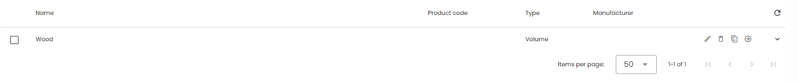

In each database Products or Materials can be added to be used later for the objects you have registered on the platform. On the database main overview page, you can see an list of all the products that have been added to the database and the actions you can perform on the products. 

Click the <iconify-icon inline icon='mdi-pencil-outline'/> icon in the products row to edit the information for this product. 
In the top toolbar you can add a new product to the database by clicking the **Add product +** button. 

## General tab

Product specific information can be entered here. 
There are 2 options for calculating information based on the Bill of Material. Only when checked this tab will be made visible. The checkbox for Calculating Environmental values will only be made visible if the checkbox for Calculating circularity is checked:

* **Do not calculate circularity values from Bill of Material**
  * Do **not** check the box if Madaster should **not** calculate circularity and density values from Bill of Materials
  * Area Composition is visible (Madaster and Madaster V2)
  * Press <iconify-icon inline icon='mdi-plus-circle-outline' /> in order to add Madaster (V2) material family. From the dropdown select the intended family and add the percentage (how much a product consists of this material family).
  * Enter the information in kg/ measurement. The measurement depends on the product type you have chosen earlier:
    - Volume (e.g. concrete = m3)
    - Area (e.g. floor = m2)
    - Length (e.g. pipe = m)
    - Quantity (e.g. Hardware = kg)
    - Other (no extra info needed)
    - Energy (no extra info needed)
  * The tab for Circularity must be filled with the information available and needed. 

* **Do calculate circularity values from Bill of Material**
  * If you do want Madaster to calculate circularity values from <a href="" target="_blank">Bill of Materials</a> then check (click) the box.
  * The tab for Circularity now has some input fields disabled for values that will be calculated. The rest can be filled in where information is available.

* **Calculate environmental values from Bill of Materials**
  * Check the box if you want Madaster to calculate environmental values from <a href="" target="_blank">Bill of Materials</a> 
  * In order to get to the tab “Bill of Material” a name must be entered, and the product be saved.
  * If environmental values are calculated from Bill of Materials, the environmental tab will not have to be filled out.

* **Do not calculate environmental values from Bill of Materials**
  * Do **not** check the box if Madaster should **not** calculate environmental values from the Bill of Materials 
  * If environmental values are not calculated from Bill of Materials, Environmental tab must be filled out

### Draft mode (only Supplier databases)

To be able to continue adding and editing products to a published databases without making them already available or visible, the author can check the box **Draft**.

<figure><figcaption>Checkbox to set product in draft mode</figcaption></figure>

Draft products are active products and have their own filter in the database (*publication status*). Additionally a tag is shown in the productlist of the database to visiualize the mode. But only owners of this database can see those products. Or use these products in a Bill of materials in another product, if for instance details of the composition shall not be published. 

Products in mode "draft" cannot be linked to elements. And once a product has been linked to an element it cannot be put in draft again.

## Circularity Tab

Material specific information can be added here. Madaster differentiates between Input and Output.

* **Feedstock Input**: If no additional data is entered the platform assumes that 100% is virgin input.
  * Renewables: Total amount of renewable input (e.g.). This percentage is divided in following categories, to which its respective percentages can be added. Please note: The percentages of all categories must equal the total amount of renewables.
    * Renewable feedstock sustainably produced 
  * Secondary Materials: Total Amount of secondary materials.
    * Recycled Content
    * Recycling Efficiency
  * Scarcity
    * Exhaustion Risk
    * Socioeconomic Scare
* **Output**: If no additional data is entered the platform assumes that 100% is incinerated
  * Available for recycling: Percentage of output which can be recycled
  * Recycling Efficiency -> see definition above
  * Landfill: Percentages of output which is landfilled
  * Incineration: Everything which is  neither recycled or landfilled is incinerated. This percentage is a function.

## Environmental Tab

Material specific information from the respective EPD can be entered here.

* **Dataset owner**: Enter the party who has created the EPD.
* **Reference year**: Enter the year in which the EPD has been created
* **Dataset valid until year**: Enter the year until which the EPD is valid
* **Compliance (Environmental product declaration)**: Choose between **EN 15804** and **EN15804+A2**. While EN15804 originates from 2012, EN15804+A2 originates from 2019 and includes more environmental indicators.
* Define the Dataset type: Enter the Dataset type
* **Enter LCA phase details**: Decide if you want to enter the data according to LCA phase (A to D) or generic information for each criterion.
  * **Enter LCA phase details EN15804**
  * **Enter LCA phase details EN15804+A2**
  * **Generic Data EN15804**
  * **Generic Data EN15804+A2**

## Bill of Materials Tab

On a product, it is possible to define a Bill of Material. This Bill of Material can be added in order to calculate circularity values as well as environmental values.

* **Adding Bill of Materials**
  1. Go to  “Bill of Materials”
  2. Click **add** in order to add a component. A new dialog will appear. Click **pick element**
  3. Search for the products needed by either scrolling through the databases or enter a key word
  4. After selecting the product (child product) of the component click **Add Part**
  5. Enter the amount either in Mass (kg / functional unit of the product) or in the unit of the child product.

* **Feedstock Input**: If no additional data is entered the platform assumes that 100% is virgin input.
* Renewables: Total amount of renewable input (e.g. ). This percentage is divided in following categories, to which its respective percentages can be added. Please note: The percentages of all categories must equal the total amount of renewables.
  * Renewable feedstock sustainably produced
* Secondary Materials: Total Amount of secondary materials.
  * Recycled content
  * Recycling Efficiency
* Scarcity
  * Exhaustion Risk
  * Socioeconomic scare
* Detachability: Detachability is relevant since depending on the connection, reuse can be simplified.
  * Connection Type
    - Unknown
    - Dry connection
    - Connection with added element
    - Direct integral connection
    - Soft chemical compound
    - Hard chemical compound
  * Connection accessibility
    - Unknown
    - Freely accessible without additional actions
    - Accessible with additional actions that do not cause damange
    - Accessible with additional operations with fully repariable damange
    - Accessible with additional operations with partially repairable damage
    - Not accessible – irreparable damange to the product or surrounding products
  * Intersections
    - Unknown
    - No intersection – modular zoning of products or elements from different layers
    - Occasional intersections of products or elements from different layers
    - Full integration of products or elements from different layers
  * Product Edges
    - Unknown
    - Open – no obstacle to the (intermediate) removal of products or elements
    - Overlap – partial obstruction to the (intermediate) removal of products or elements
    - Closed – complete obstruction to (intermediate) removal of products and elements
* **Output**: If no additional data is entered the platform assumes that 100% is incinerated
  * Available for recycling: Percentage of output which can be recycled
  * Recycling Efficiency -> see definition above
  * Landfill: Percentages of output which is landfilled
  * Incineration: Everything which is neither recycled or landfilled is incinerated. This percentage is a function.

## Search Criteria Tab

Enter one or more search criteria for the respective material.

* **Add Criterion**: Press Add Criterion to add a new criterion
* **Search Criterion**: Enter words which could be used in the BIM File to describe the element. The more accurate the search criterion the better the matching process and the less efforts for users.
* **Matching Type**: Define if the imported elements have to match with the respective search criterion or if the criterion is only part of the descriptions imported. Users can choose between following matching types:
* **Languages**: Choose language of your search criterion

## Financial Tab

Enter information relevant to the financial assessment of the product

* **Select Type of Price Information: Choose between following price information**
  * Default priceset
  * Manual entry
  * Automatic import
* **Default priceset**
* **Manual entry**
* **Automatic import**

## Difference between products and components

**Components** always refer to other components or products for the calculation of mass, circularity, environmental and financial data. In addition, the name of the reference components or products is always listed in the evaluation.

For example, if a component A consists of product 1 and product 2 from database P, and this component is linked to an element, product 1 and product 2, as well as database P, will appear in the evaluation.

Products can also reference other products/components. However, the evaluation always mentions the name of the created product – not the name of the referenced products/components.

For details see <a href="..resources/release-notes#release-notes-20257" target="_blank">Release notes 2025.7</a>.