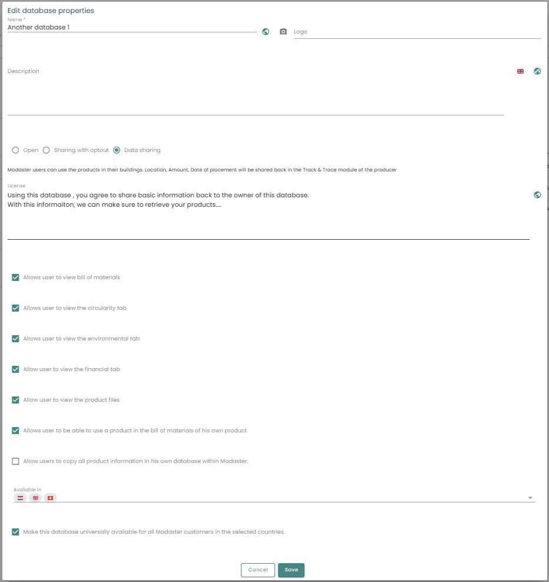

Database configuration, sourcing and maintenance.

Madaster distinguishes 3 types of Databases: 
  * Verified databases, 
  * Supplier databases, 
  * Customer databases: a customer can create its own databases of product to be used in its buildings.

## Existing Databases

System and Supplier specific databases are found on the left side navigation, at the bottom, behind the expandable **System databases & Suppliers**. 
* System or verified databases: e.g. EPEA, Ökobaudat <iconify-icon inline icon='mdi-database-check-outline'/> 
  <a href='../../../files/en/EPEA_Generic.xlsx' target='_blank'>EPEA Excel for download</a>
* Supplier databases: constantly growing.  <iconify-icon inline icon='mdi-database' /> 
* Individual user Databases
* History: Madaster and Madaster C2C

## Database at different levels (account / folder / building)

The account/folder type structure in Madaster is flexible and can be set-up according to own preferences. The platform allows several folders per account, which may contain subfolders or buildings/infra objects. To support this structure in terms of materials and products, it is possible to create and use one or multiple databases, on each level (account, folder, project/object) within the own account.

1. Database at account level 
  * A database on this level can be used by all underlying folder levels and projects/objects within the account. The database can also be shared with other accounts.
2. Database at folder level
  * A database on this level can only be used by projects/objects in the selected folder and underlying levels. The database can also be shared with other accounts.
3. Database at project/object level 
  * A database on this level can only be used by the selected project/object. The database CANNOT be shared with other accounts. 

## User permission

1. **Contributors** can add and modify materials and products in database on the platform
2. **Administrators** can additionally manage users and share the database with additional accounts

## Add API Token

1. For more information on using the Madaster API, visit our <a href="../api/index.md" target="_blank">API Documentation</a>

## Product information

Please see <a href="../knowledge-base/databases-products" target="_blank">here</a>.

## Database configuration
When you have a database under an account or object, the properties are limited in what you can configure: a simple name, description, language and if it should be selected on upload. But when you are editing a supplier database, there a lot more options or properties to configure:

First of you can choose how your products are shared within the Madaster platform:
- **Open** : Madaster users can use the products in their buildings and do not share information back
- **Sharing with optout** : Madaster users can use the products in their buildings and choose whether they want to share information back.
- **Datasharing** : Madaster users can use the products in their buildings. Location, Amount, Date of placement will be shared back in the Track & Trace module of the producer
And with this choice, you can set a license text for the users of the products in your database. 

Next is a set of checkboxes, all regarding the Product Information of the products in your database. You can set whether or not the users: 
- can see the **Bill of Materials**
- can see the **Circularity tab**
- can see the **Environmental tab**
- can see the **Financial tab**
- can see the **Product files**
- can use the product in their own Bill of Materials
- can copy all product information in their own database

Last things to configure is the countries for which you want to be available and check if the database is available for all Madaster customers in these countries.

## Database sourcing
The database and its products can be filled in manually, as described above. Another possibility is upload by Excel file or through the API programmatically. For these sources you can find more information at [Api reference](../api/index.md).

## Database maintenance
Your database should be maintained on a regular base, make sure your products are still up to date and your files are still good. The information coming from your database will help keeping the calculations and information of other objects and buildings, not only your own, of high quality.

