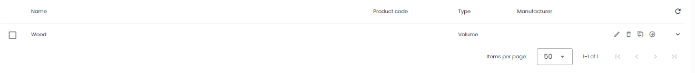

Database configuration, sourcing and maintenance.

Madaster distinguishes 3 types of Databases: 
  * Verified databases, 
  * Supplier databases, 
  * Customer databases: a customer can create its own databases of product to be used in its buildings.

## Existing Databases

System and Supplier specific databases are found on the left side navigation, at the bottom, behind the expandable **System databases & Suppliers**. 
* System or verified databases: e.g. EPEA, Ökobaudat <iconify-icon inline icon='mdi-database-check-outline'/> 
  <a href='../../../files/en/EPEA_Generic.xlsx' target='_blank'>EPEA Excel for download</a>
* Supplier databases: constantly growing.  <iconify-icon inline icon='mdi-database' /> 
* Individual user Databases
* History: Madaster and Madaster C2C

## Database at different levels (account / folder / building)

The account/folder type structure in Madaster is flexible and can be set-up according to own preferences. The platform allows several folders per account, which may contain subfolders or buildings/infra objects. To support this structure in terms of materials and products, it is possible to create and use one or multiple databases, on each level (account, folder, project/object) within the own account.

1. Database at account level 
  * A database on this level can be used by all underlying folder levels and projects/objects within the account. The database can also be shared with other accounts.
2. Database at folder level
  * A database on this level can only be used by projects/objects in the selected folder and underlying levels. The database can also be shared with other accounts.
3. Database at project/object level 
  * A database on this level can only be used by the selected project/object. The database CANNOT be shared with other accounts. 

## User permission

1. **Contributors** can add and modify materials and products in database on the platform
2. **Administrators** can additionally manage users and share the database with additional accounts

## Add API Token

1. For more information on using the Madaster API, visit our <a href="../api/index.md" target="_blank">API Documentation</a>

## Product Information
In each database Products or Materials can be added to be used later for the objects you have registered on the platform. On the database main overview page, you can see an list of all the products that have been added to the database and the actions you can perform on the products. 

Click the <iconify-icon inline icon='mdi-pencil-outline'/> icon in the products row to edit the information for this product. 
In the top toolbar you can add a new product to the database by clicking the **Add product +** button. 

### General tab

Product specific information can be entered here. 
There are 2 options for calculating information based on the Bill of Material. Only when checked this tab will be made visible. The checkbox for Calculating Environmental values will only be made visible if the checkbox for Calculating circularity is checked:

* **Do not calculate circularity values from Bill of Material**
  * Do **not** check the box if Madaster should **not** calculate circularity and density values from Bill of Materials
  * Area Composition is visible (Madaster and Madaster V2)
  * Press <iconify-icon inline icon='mdi-plus-circle-outline' /> in order to add Madaster (V2) material family. From the dropdown select the intended family and add the percentage (how much a product consists of this material family).
  * Enter the information in kg/ measurement. The measurement depends on the product type you have chosen earlier:
    - Volume (e.g. concrete = m3)
    - Area (e.g. floor = m2)
    - Length (e.g. pipe = m)
    - Quantity (e.g. Hardware = kg)
    - Other (no extra info needed)
    - Energy (no extra info needed)
  * The tab for Circularity must be filled with the information available and needed. 

* **Do calculate circularity values from Bill of Material**
  * If you do want Madaster to calculate circularity values from <a href="" target="_blank">Bill of Materials</a> then check (click) the box.
  * The tab for Circularity now has some input fields disabled for values that will be calculated. The rest can be filled in where information is available.

* **Calculate environmental values from Bill of Materials**
  * Check the box if you want Madaster to calculate environmental values from <a href="" target="_blank">Bill of Materials</a> 
  * In order to get to the tab “Bill of Material” a name must be entered, and the product be saved.
  * If environmental values are calculated from Bill of Materials, the environmental tab will not have to be filled out.

* **Do not calculate environmental values from Bill of Materials**
  * Do **not** check the box if Madaster should **not** calculate environmental values from the Bill of Materials 
  * If environmental values are not calculated from Bill of Materials, Environmental tab must be filled out

### Circularity Tab

Material specific information can be added here. Madaster differentiates between Input and Output.

* **Feedstock Input**: If no additional data is entered the platform assumes that 100% is virgin input.
  * Renewables: Total amount of renewable input (e.g.). This percentage is divided in following categories, to which its respective percentages can be added. Please note: The percentages of all categories must equal the total amount of renewables.
    * Renewable feedstock sustainably produced 
  * Secondary Materials: Total Amount of secondary materials.
    * Recycled Content
    * Recycling Efficiency
  * Scarcity
    * Exhaustion Risk
    * Socioeconomic Scare
* **Output**: If no additional data is entered the platform assumes that 100% is incinerated
  * Available for recycling: Percentage of output which can be recycled
  * Recycling Efficiency -> see definition above
  * Landfill: Percentages of output which is landfilled
  * Incineration: Everything which is  neither recycled or landfilled is incinerated. This percentage is a function.

### Environmental Tab

Material specific information from the respective EPD can be entered here.

* **Dataset owner**: Enter the party who has created the EPD.
* **Reference year**: Enter the year in which the EPD has been created
* **Dataset valid until year**: Enter the year until which the EPD is valid
* **Compliance (Environmental product declaration)**: Choose between **EN 15804** and **EN15804+A2**. While EN15804 originates from 2012, EN15804+A2 originates from 2019 and includes more environmental indicators.
* Define the Dataset type: Enter the Dataset type
* **Enter LCA phase details**: Decide if you want to enter the data according to LCA phase (A to D) or generic information for each criterion.
  * **Enter LCA phase details EN15804**
  * **Enter LCA phase details EN15804+A2**
  * **Generic Data EN15804**
  * **Generic Data EN15804+A2**

### Bill of Materials Tab

On a product, it is possible to define a Bill of Material. This Bill of Material can be added in order to calculate circularity values as well as environmental values.

* **Adding Bill of Materials**
  1. Go to  “Bill of Materials”
  2. Click **add** in order to add a component. A new dialog will appear. Click **pick element**
  3. Search for the products needed by either scrolling through the databases or enter a key word
  4. After selecting the product (child product) of the component click **Add Part**
  5. Enter the amount either in Mass (kg / functional unit of the product) or in the unit of the child product.

* **Feedstock Input**: If no additional data is entered the platform assumes that 100% is virgin input.
* Renewables: Total amount of renewable input (e.g. ). This percentage is divided in following categories, to which its respective percentages can be added. Please note: The percentages of all categories must equal the total amount of renewables.
  * Renewable feedstock sustainably produced
* Secondary Materials: Total Amount of secondary materials.
  * Recycled content
  * Recycling Efficiency
* Scarcity
  * Exhaustion Risk
  * Socioeconomic scare
* Detachability: Detachability is relevant since depending on the connection, reuse can be simplified.
  * Connection Type
    - Unknown
    - Dry connection
    - Connection with added element
    - Direct integral connection
    - Soft chemical compound
    - Hard chemical compound
  * Connection accessibility
    - Unknown
    - Freely accessible without additional actions
    - Accessible with additional actions that do not cause damange
    - Accessible with additional operations with fully repariable damange
    - Accessible with additional operations with partially repairable damage
    - Not accessible – irreparable damange to the product or surrounding products
  * Intersections
    - Unknown
    - No intersection – modular zoning of products or elements from different layers
    - Occasional intersections of products or elements from different layers
    - Full integration of products or elements from different layers
  * Product Edges
    - Unknown
    - Open – no obstacle to the (intermediate) removal of products or elements
    - Overlap – partial obstruction to the (intermediate) removal of products or elements
    - Closed – complete obstruction to (intermediate) removal of products and elements
* **Output**: If no additional data is entered the platform assumes that 100% is incinerated
  * Available for recycling: Percentage of output which can be recycled
  * Recycling Efficiency -> see definition above
  * Landfill: Percentages of output which is landfilled
  * Incineration: Everything which is neither recycled or landfilled is incinerated. This percentage is a function.

### Search Criteria Tab

Enter one or more search criteria for the respective material.

* **Add Criterion**: Press Add Criterion to add a new criterion
* **Search Criterion**: Enter words which could be used in the BIM File to describe the element. The more accurate the search criterion the better the matching process and the less efforts for users.
* **Matching Type**: Define if the imported elements have to match with the respective search criterion or if the criterion is only part of the descriptions imported. Users can choose between following matching types:
* **Languages**: Choose language of your search criterion

### Financial Tab

Enter information relevant to the financial assessment of the product

* **Select Type of Price Information: Choose between following price information**
  * Default priceset
  * Manual entry
  * Automatic import
* **Default priceset**
* **Manual entry**
* **Automatic import**

## Database configuration
When you have a database under an account or object, the properties are limited in what you can configure: a simple name, description, language and if it should be selected on upload. But when you are editing a supplier database, there a lot more options or properties to configure:

First of you can choose how your products are shared within the Madaster platform:
- **Open** : Madaster users can use the products in their buildings and do not share information back
- **Sharing with optout** : Madaster users can use the products in their buildings and choose whether they want to share information back.
- **Datasharing** : Madaster users can use the products in their buildings. Location, Amount, Date of placement will be shared back in the Track & Trace module of the producer
And with this choice, you can set a license text for the users of the products in your database. 

Next is a set of checkboxes, all regarding the Product Information of the products in your database. You can set whether or not the users: 
- can see the **Bill of Materials**
- can see the **Circularity tab**
- can see the **Environmental tab**
- can see the **Financial tab**
- can see the **Product files**
- can use the product in their own Bill of Materials
- can copy all product information in their own database

Last things to configure is the countries for which you want to be available and check if the database is available for all Madaster customers in these countries.

## Database sourcing
The database and its products can be filled in manually, as described above. Another possibility is upload by Excel file or through the API programmatically. For these sources you can find more information at [Api reference](../api/index.md).

## Database maintenance
Your database should be maintained on a regular base, make sure your products are still up to date and your files are still good. The information coming from your database will help keeping the calculations and information of other objects and buildings, not only your own, of high quality.

