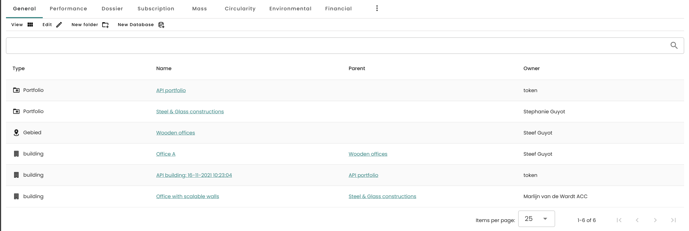

## Flexible folder structure

Each account is completely free to decide their own folder structure. By means of the different roles and permissions of users, it is possible to set user access and permissions per level (accound-, folder-, or building level).

A few examples:
- A large construction company has several companies and subsidiaries. The projects for the different clients can now be organized per company/subsidiary.
- A nationally operating developer has divided the company into regions, with a department for "residential construction" and "non-residential construction" for each region. Various projects or area developments are underway in which the buildings are registered.
- An architectural firm wants to organize the projects per year and per sector (care, education, offices). Within the sectors there are projects with several buildings.

In the **General** Tab, the **View** <iconify-icon inline icon='mdi-format-list-bulleted-square'/> button (when clicked) shows a overview of all folders included in the account as well as their types, owner and parentfolder (if applicable).

## Default folder types 

1. Madaster offers various default **Folder types** which can be customized from the account-level after clicking on the <iconify-icon inline icon='mdi-dots-vertical'/> in the top menu and selecting **Folder types**.
2. For all **Folder types**, the following properties can be edited by clicking on the <iconify-icon inline icon='mdi-pencil-outline'/> icon:
* Choose a name and plural name for this folder type, for each language your users may use. 
* Choose a description for this folder type that is clear and defines the purpose of this specific type
* Checkboxes:
  - *Folder type allowed directly under account?*: On account level, it is possible to create a new folder of this type. 
  - *Buildings can be added in this folder type*: Inside a folder of this type, it is possible to create a new building.
  - *Does a folder of this folder type require an address?*: When creating a folder of this type, it is mandatory to define its address.
  - *Folder of this type is a region defined by spatial coordinates?*: When creating a folder of this type, it is mandatory to define the counties and municipals included.
  - *Allow search criteria*: The folder type will have its own tab **Materials & Products**, where it is possible to add individual search criteria to products.
  - *CRREM report generation possible* (only visible if CRREM tool is activated): In the **ESG** Tab, after selecting the CCREM calculation, it is possible to generate a CRREM report of all buildings in the folder as long as in the buildings respectively have the "Include" box checked in the CRREM settings under "Input".
  - *Legal role and approval of database licensing possible*: In these folders, it is possible to distribute "legal" roles to users (for more information on legal and other roles, go to the **Knowledge Base** page and to **[Users](./users.md)**).
* Define which folder types (if applicable) are allowed in this type of folder as a subfolder. You can select folder types from the drop down by checking the boxes of available types. 
* Choose an icon that fits your folder type.
* Upload a custom logo for this type of folder. 

## Custom folder types

Additional custom folder types can be created by using the **Folder Type** <iconify-icon inline icon='mdi-plus-circle-outline'/> button from the folder type settings page. The same properties as mentioned above can be set. 
