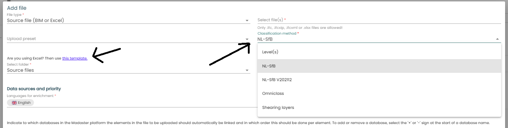

Within Madaster there are a few ways to upload your building files. One way is via an Excel file. For each available Classification Method, there is an Excel template file available for download. 

## Getting the Excel template for your classification method

1. From the building-level **General** tab, select **Upload**
2. Select the <a href="classifications" target="_blank">Classification Method</a> from the dropdown.
3. Download the corresponding Excel Template using the link on the left side.

The template needs to be filled in with the best possible information for the calculations to be correct. 
After the template is filled it can be used to upload your file. 

## Filling the template
In the excel file, on the first tab (or work sheet), there is a quick start explanation about what to fill in at which sheet and cells. 

There are 3 tabs for specific building phases: **Demolition**, **Preserved** and **New Materials**. 
* Demolition: Describe here the materials and products that will be removed from the building during the 'Demolition' phase.
* Preserved: Describe here the materials and products used in the current situation of building and remaining in the building.
* New materials: Describe here the completely new (primary) and/or recycled materials and products that are added to the building.

On the last sheet, the available classifications are mentioned that are included for the choosen method of Classification. These options are linked to the cells in the sheets before where classification for an element is declared. This way, you should be able to pick a classification that is not correct or miss spell the official clssification name. 

For each material or product added to the sheet of it's building phase, there are a lot of columns to fill. Some are mandatory, some optional. 

| Column letter | Column name | Explanation |
|-|-|-|
|A| GTIN | Optional, for use in matching: GTIN (EAN) of the product|
|B| Article number | Optional, for use in matching : Manufacturer's article number, Eventually concatenated with the manufacturer's GLN (format [ article number ] [ GLN ]).|
|C|	Madaster Id | Optional, for use in matching: The identifier of the product in a database of the Madaster Platform.|
|D| External Database Identifier | Optional, for use in matching: The identifier of the product in an external database supported by Madaster.|
|E| Description | Optional: add a description/typename for the element |
|F| Material/Product | Enter your material- or product name.|
|G| Classification code | Enter the code from the classification. |
|I| Floor | Enter the floor on which the supplied material/product is located.
|J| Volume | Enter the volume in m3, or |
|K|	Area | Enter the area in m², or |
|L| Length	| Enter the length in m |
|M|	Amount | Enter the amount. (only applicable when entering products) |
|N|	Detachability - Connection type| (Product only) Select the connection type of the product with the bearing product |
|Q|	Detachability - Accessibility of the connection| (Product only) Select the value for accessibility of the connection |
|S|	Detachability - Intersections | (Product only) Select the value for product intersections. |
|U|	Detachability - Product edges inclusion | (Product only) you can assess how products are placed in a  composition and whether this is open or closed. As the name suggests, this has to do with the physical "edges" of the product or element. Is a product situated in such a way that it is "enclosed" by surrounding products, then one speaks of  edge confinement. This makes it impossible to disassemble a product other than in the reverse order of construction. The factor of edge confinement is relevant in two situations: 1) for single products that are enclosed by the composition 2) for serial products that enclose each other

