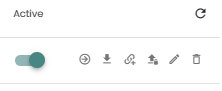
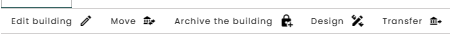

Organize Source Files, General Documents, Projects, Databases and Folders

## Types of files

On every level – Account, Folder, Building, there is a dossier where you can store and organize your documentation, links and source files. On Account and Folder level you may upload general documents and links. Source files are only relevant on Building level.

Within the Madaster Platform a distinction is made between two types of files, namely:
* **Source files**: the files with which the materials and products and the quantities of a building are delivered to be registered in Madaster. These include the IFC files and the Excel template of Madaster.
* **General files**: static files that contain information about the building and can be added to the building file in Madaster, but which cannot be used to serve as a source file.

## Organize Source Files

In Dossier of Buildings you can add, view, modify, delete and download available source files.

Choose the source file you want to modify, download or delete. A number of icons are displayed behind the source file.

The arrow icon <iconify-icon inline icon='mdi-arrow-right-circle-outline' /> gives you insight into the quality of the source file and allows you to manually enrich and activate/deactivate the file.

Using the 2nd icon <iconify-icon inline icon='mdi-download' /> you can download the file to your computer.

The 3rd icon <iconify-icon inline icon='mdi-link-variant-plus' /> gives you direct access to the enrichment process.

The 4th icon <iconify-icon inline icon='mdi-upload-lock' /> is for uploading a new version of the source file.

Using the 5th icon <iconify-icon inline icon='mdi-pencil-outline' /> you can change the so called ‘tags’ (search terms) of your source file.

The last displayed icon <iconify-icon inline icon='mdi-delete-outline' /> gives you the possibility to delete the uploaded file.

Please note: you cannot undo this deletion action. If you don’t want to use a file for the results of the building, you can also change the status to ‘inactive’ and you don’t have to delete the file. The explanation of this can be found under ‘how do I change the status from active to inactive?

## Presets for Source File Uploads

Madaster offers the ability to create various Presets for Source File Uploads which can be customized from the account-level Settings tab:

1. Click the Presets for Upload button and configure the following properties and settings:
2. Enter a name for your preset. Choose the Classification method that is used in the source file.
3. Choose your preferred Classification method. 
4. You can now enter which PropertySets and Property Names are used in your models for Building number, Phase, Classification codes, GTIN, reuse percentage and Material descriptions.
5. Data sources and priority can be chosen. Click + on available sources to select. Drag and drop to decide the order of which the data sources will be searched for matching.
6. To enrich the search criteria, languages can be selected if relevant for the selected data source. If a language is selected, it will be taken in account while matching the data from the database to the data of the source file.

## Organize General Document

In Dossier of Buildings you can add, view, edit, delete and download available General files. 
Choose the file you want to edit, download or delete. Three icons are displayed behind the file, which enables you to download, edit folder or tags and deleted the file.
* Filing system.
When you upload a General Document, you must choose one of more folders to put the file in. In the Dossier you can filter by these folders:
    * Contracts & Warranties.
    * Drawings & Calculations.
    * Productspecs & manuals.
    * Suppliers & Certificates.

## Search for files in the Dossier

In the Dossier there are two ways to find General Documents and Source files, namely via the search function;
    * Filter on keywords in the file names or tags of source files and General Documents.
    * Browse the folders.
    * You can also (under the folder structure) click on one or more tags to filter on them.

## Manage objects

### Move objects

If needed, projects can be moved from one folder to another.

1. Click **Move** in the **General** tab of the desired building. A list of available folders will show up. Choose in which folder you want the building to move and click **Save**.

### Archive objects

If needed, projects can be moved from a folder to the archive.

1. Click **Archive the building** in the **General** tab of the desired building. A dropdown menu will appear with the following options: 
- **Full archive**
- **Partial archive**.

Full archive – the entire archive is created and kept in the original account, including a database with all materials and products used (in the initial building). The fully archived building dossier can then be transferred to another Madaster account.

2. When selecting **Full archive** or **Partial archive**, a pop up screen with two parameters will appear. Version name which is obligatory, and Version identifier which is voluntarily. You are also asked to choose which type of passport you want to configure and archive along with your building.

You must specify the language of the archive.

### Transfer objects

1. You can **Create a full archive of the building in another account** or **Create a partial archive of the building in another account** with the Transfer button in the **General** tab.

2. Create a full archive of the building in another account – the entire archive is created and immediately transferred to another account without being kept in the original account. The copied building can be edited under the new account and contains a database with all (in the initial building) applied materials and products.

Create a partial archive of the building in another account – the partial archive is created and transferred directly to another account without being kept in the original account. The copied building can be edited under the new account and contains a database containing only the materials and products used (in the initial building) from non-worldwide databases.

3. You are asked to choose which type of passport you want to configure and archive along with your building.

You must specify the language of the archive.

### Split objects

The split object function is only available on request. It offers the functionality of splitting an IFC model into separate parts (for example apartments). The requirement of the IFC model is that is contains a “Building number” or “Apartment number” so the Madaster platform can recognize the separate pieces. The splitting of an IFC model is recommended only after full enrichment of a building.

1. Click **Upload settings** in the **Settings** tab of the desired building.

2. The fields Upload setting, **Classification method**, **Property Set for building number**, **Property Name for the building number** and **Languages for enrichment** can be entered with the required data.

3. After the processing process is finished, the user can link ‘Non-linked elements’, change them or activate relevant IFC files.

4. Click on **Split the building** to place the request for the Madaster platform to make individual Material passports on the basis of the building number.

### Design

The Design button in the General tab allows you to easily duplicate a building and then adjust the added design in Madaster (i.e., link other materials/products to IFC elements) and immediately see the impact of this on the various insights that Madaster offers (including circularity, embodied carbon, etc.). Multiple design models can be added per building. Each design model is displayed in the vertical navigation tree below the initial building. Designs cannot contain designs themselves and cannot be moved, archived, or transferred to another account.